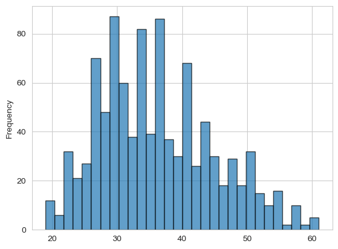
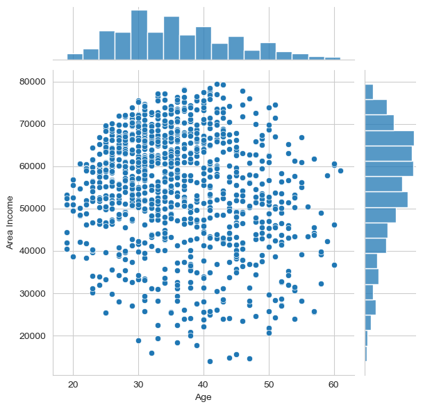
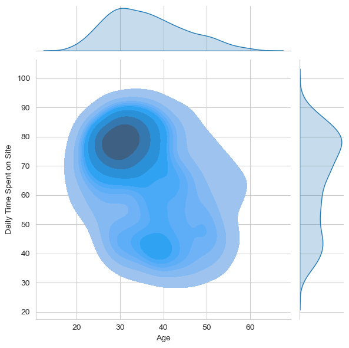
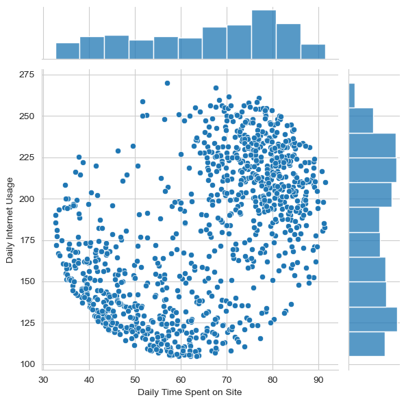
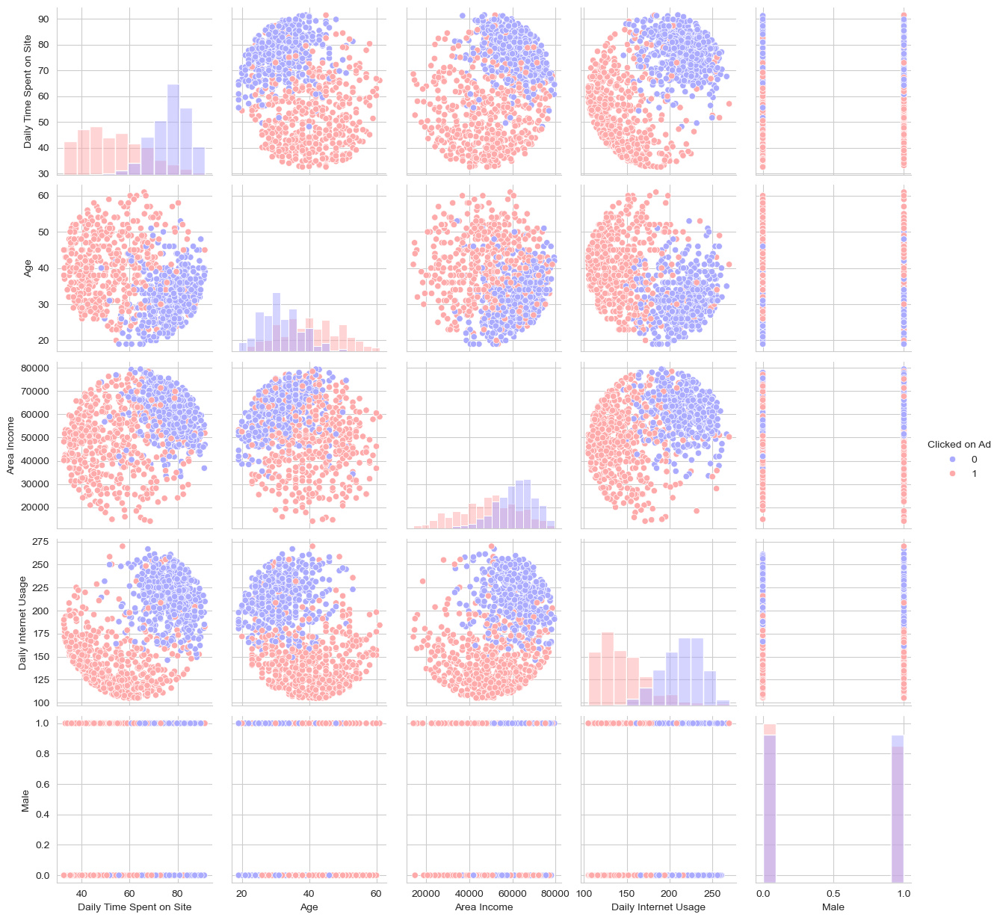
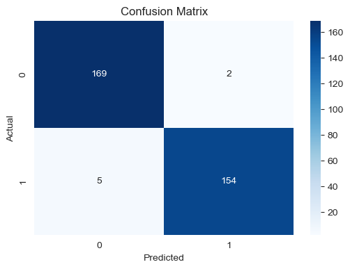

# 🚀 Logistic Regression Project

## 🔍 Predicting Ad Clicks Using Machine Learning

This project applies **Logistic Regression** to predict whether an internet user will click on an advertisement. By analyzing key user behavior metrics such as daily time spent on a site, age, area income, and internet usage, the model provides insights that can help improve targeted advertising strategies.

---

## 📌 Table of Contents

* 📂 Project Overview
* 📊 Dataset Information
* 📁 Project Structure
* 📈 Exploratory Data Analysis (EDA)
* ⚙️ Data Preprocessing
* 🤖 Model Development
* 📝 Model Evaluation
* 📌 Key Visualizations
* 🔚 Conclusion

---

## 📂 Project Overview

* **Goal:** Predict whether a user will click on an advertisement
* **Algorithm Used:** Logistic Regression
* **Dataset:** `advertising.csv`
* **Libraries Used:** Pandas, NumPy, Matplotlib, Seaborn, Scikit-learn

Understanding user behavior in digital marketing is essential for optimizing advertisements. This project builds a classification model to help businesses target users more effectively.

---

## 📊 Dataset Information

The dataset contains features related to user demographics and online behavior:

| Feature                  | Description                                          |
| ------------------------ | ---------------------------------------------------- |
| Daily Time Spent on Site | Time (in minutes) a user spends daily on the website |
| Age                      | Age of the user                                      |
| Area Income              | Average income of the user's geographical area       |
| Daily Internet Usage     | Time (in minutes) spent online daily                 |
| Ad Topic Line            | Headline of the advertisement                        |
| City                     | User's city                                          |
| Male                     | Gender indicator (1 = Male, 0 = Female)              |
| Country                  | User's country                                       |
| Timestamp                | Time when the user was shown the ad                  |
| Clicked on Ad            | Target variable (1 = Clicked, 0 = Not Clicked)       |

---

## 📈 Exploratory Data Analysis (EDA)

EDA was performed to understand patterns and relationships in the data:

* Age distribution analysis
* Daily Time Spent vs Ad Clicks
* Income distribution
* Daily Internet Usage vs Clicks
* Correlation analysis between numerical features

---

## 📌 Key Visualizations

### 📊 Age Distribution

### 📈 Area Income vs Age

### 📉 Daily Time Spent vs Age (KDE)

### 🔄 Daily Time Spent vs Internet Usage

### 🧩 Pairplot (Clicked vs Not Clicked)

> 📌 *Note:* Place your generated plots inside an `images/` folder in your repository and update filenames if needed.

---

## ⚙️ Data Preprocessing

Before training the model, the following steps were applied:

* Handling missing values
* Encoding categorical variables
* Feature scaling (standardization)

---

## 🤖 Model Development

Steps followed:

1. Split data into training and testing sets
2. Train Logistic Regression model
3. Tune hyperparameters (regularization parameter **C**)

---

## 📝 Model Evaluation

### 📊 Confusion Matrix

## 🔚 Conclusion

### ✅ Insights Gained:

* Users spending more time on the site are more likely to click ads
* Age and income significantly influence ad click behavior
* Logistic Regression provides a strong baseline model

⭐ If you found this project helpful, consider giving it a star!
